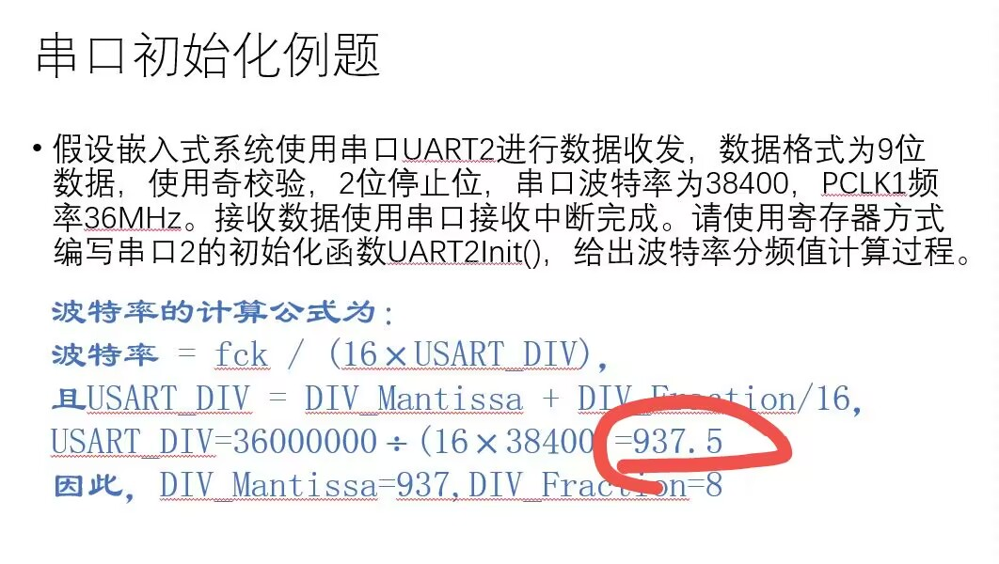

# 问答题
## 嵌入式系统定义、特点
### 定义
1. 从技术的角度定义：以应用为中心、以计算机技术为基础、软件硬件可裁剪、适应应用系统对功能、可靠性、成本、体积、功耗严格要求的专用计算机系统。
2. 从系统的角度定义：嵌入式系统是设计完成复杂功能的硬件和软件，并使其紧密耦合在一起的计算机系统。术语嵌入式反映了这些系统通常是更大系统中的一个完整的部分，称为嵌入的系统。嵌入的系统中可以共存多个嵌入式系统。
   
### 特点
1. **专用、软硬件可剪裁可配置**
2. **低功耗、高可靠性、高稳定性**
3. **实时性**
4. 软件代码短小精悍
5. 代码可固化
6. 弱交互性
7. 嵌入式系统软件开发通常需要专门的开发工具和开发环境
8. 要求开发、设计人员有较高的技能
## ARM全称、什么是ARM
### 全称
ARM是Advanced RISC Machines的缩写，它是一家微处理器行业的知名企业，该企业设计了大量高性能、廉价、耗能低的RISC （精简指令集）处理器。\

### 什么是ARM
ARM处理器为RISC（精简指令集计算机）芯片，其简单的结构使ARM内核非常小，这使得器件的功耗也非常低。它具有经典RISC的特点：
1. 数据处理 操作只针对寄存器的内容，而不直接对存储器进行操作
2. 简单的寻址模式
3. 统一和固定长度的指令域，简化了指令的译码
4. 每条数据处理指令都对算术逻辑单元和移位器控制，以实现ALU和移位器的最大利用
5. 地址自动增加和减少寻址模式，优化程序循环
6. 多寄存器装载和存储指令实现最大数据吞吐量
7. 所有指令的条件执行实现最快速的代码执行
## Thumb-2指令集
- Thumb-2指令集体系架构，**无需处理器进行工作状态的显示切换**，就可运行16位与32位混合代码。**Cortex-M3处理器**使用的指令集是Thumb-2指令集的子集，**它的（指令）工作状态只有一个，那就是Thumb-2状态**。
- •  它是另起炉灶，继承并集成了传统的Thumb指令集和ARM指令集的各自优点，可以完全代替Thumb和原先的ARM指令集，
- **是Thumb指令集和ARM指令集的一个超集。**
- 指令执行长度的确定
    >PC寄存器指向的半字中，Bits<15:11>决定该半字是16-
    bit指令，还是属于32-bit指令的一部分。

## 总线分类
### AMBA总线分类
1. AHB：Advanced High Performance Bus，用于高性能系统模块的连接，支持突发模式数据传输和事务（ACID：原子性、一致性、隔离性和持久性）分割；
2. ASB：Advanced System Bus，也用于高性能系统模块的连接，支持突发模式数据传输，这是较老的系统总线格式，后来由AHB总线替代；
3. APB：Advanced Peripheral Bus，用于较低性能外设的简单连接，一般是接在AHB或ASB系统总线上的第二级总线。
### ==Cortex-M3总线结构==
    Cortex-M3 采用哈佛结构，数据、指令分别存取。
1. **I-Code指令总线**:基于AHB‐Lite总线协议的32位总线，默认映射到0x00000000~0x1FFFFFFF内存地址段，**主要用于取指操作**。
2. **D-Code数据总线**:基于AHB‐Lite总线协议的32位总线，默认映射到0x00000000~0x1FFFFFFF内存地址段，**主要用于数据访问操作**。
3. **系统总线**:基于AHB‐Lite总线协议的32位总线，默认映射到0x20000000~0xDFFFFFFF和0xE0100000-0xFFFFFFFF两个内存地址段，**用于访问内存和外设**，即SRAM，片上外设，片外RAM，片外扩展设备以及系统级存储区。
4. **外设总线**:基于APB总线协议的32位总线，**用于访问私有外设**，默认映射到0xE0040000-0xE00FFFFF内存地址段。由于TPIU、ETM以及ROM表占用部分空间，实际可用地址区间为0xE0042000-0xE00FF000。

## 寄存器作用
### R0-R12：通用寄存器
R0‐R12 都是32 位通用寄存器，用于数据操作。但是注意：绝大多数16 位Thumb 指令只能访问R0‐R7，而32 位Thumb‐2 指令可以访问所有寄存器。

### R13：堆栈寄存器(SP)
Cortex‐M3 拥有两个堆栈指针，任一时刻只能使用其中的一个。
主堆栈指针（MSP）：**复位后缺省使用的堆栈指针**，用于操作系统内核以及异常处理例程（包括中断服务例程）
进程堆栈指针（PSP）：**由用户的应用程序代码使用**。
由于R13的最低两位被硬线连接到0,堆栈指针的最低两位永远是0，这意味着堆栈总是4 字节对齐的。

### R14:连接寄存器(LR) 
当调用一个子程序时，由R14 存储返回地址，**把返回地址直接存储在寄存器中**.ARM 减少访问内存的次数（访问内存的操作往往要3 个以上指令周期）。

### R15:程序计数寄存器PC
**取值指令的地址。**

### Cortex-M3特殊功能寄存器
**三类特殊功能寄存器:**
1. 程序状态寄存器组（Program Status Register, PSRs）
   - 应用程序PSR（APSR）：占据第27-31位
   - 中断号PSR（IPSR） ：占据第0-8位，ICI/IT位 (中断可持续指令位/IF-THEN指令状态位)
   - 执行PSR（EPSR）：占据第10-15和24-26位，
   + 中断可持续指令(ICI)，利用ICI为保存执行进度，中断恢复时从被中断处继续执行该指令；IT-THEN指令

2. 中断屏蔽寄存器组（PRIMASK, FAULTMASK, BASEPRI）

    |名称 | 功能描述|
    |--|:--:|
    |PRIMASK | 这是个只有1个bit的寄存器。当它置1时，就关掉所有可屏蔽的异常(中断) ，只剩下NMI和硬fault可以响应。它的缺省值是0，表示没有关中断。|
    |FAULTMASK|这是个只有1个bit的寄存器。当它置1时，只有NMI才能响应，所有其它的异常，包括中断和fault，通通失效。它的缺省值也是0，表示没有关异常。|
    |BASEPR|这个寄存器最多有9 个bits（由优先级的位数决定）。它定义了被屏蔽优先级的阈值。当它被设成某个值后，所有优先级号大于等于此值的中断都被关闭（优先级号越大，优先级越低）。但若被设成0，则不关闭任何中断，0 也是缺省值。|

3. 控制寄存器（CONTROL）
   
   位|功能描述
   -|-
   CONTROL[0]|0 表示特权级的线程模式<br>1 表示用户级的线程模式<br>①仅当在特权级下操作时才允许写该位。<br>②一旦进入了用户级，唯一返回特权级的途径，就是触发中断异常，再由中断服务例程改写该位。<br>注意：Handler 模式永远都是特权级的|
   CONTROL[1]|①堆栈指针选择<br>0 表示选择主堆栈指针MSP（复位后缺省值）<br>1 表示选择进程堆栈指针PSP<br>② 在handler 模式下，只允许使用MSP。<br>③在线程或基础级，可以使用PSP。<br>④在线程模式中则可以为0（特权级）或1（用户级）。<br>⑤仅当处于特权级的线程模式下，此位才可写。

## Cortex-M3处理器工作模式
### Cortex-M3的两个工作状态
1. Thumb-2状态
2. 调试状态
### 工作模式与特权等级
|   |特权级|用户级|
|---|---|----|
|**异常Handler的代码**|Handler 模式|错误的用法
|**主应用程序的代码**|线程模式|线程模式|

Cortex‐M3处理器的工作模式和特权等级共有三种配合。
线程模式+用户级
线程模式+特权级
Handler模式+特权级
**复位后，处理器==首先进入==线程模式＋特权级。**


+ 在“线程模式+用户级”下，
禁止访问包含配置寄存器以及调试组件寄存器的系统控制空间（SCS）；
禁止使用MSR访问除APSR外的特殊功能寄存器。
+ 在特权级下（“处理(Handler)模式 or 线程模式”）
可操作CONTROL寄存器，通过置位CONTROL[0]来进入用户级；
不管是任何原因产生了任何异常，处理器都将以特权级来运行其服务例程；
异常返回后将回到产生异常之前的特权级。
+ 用户级下（“线程模式”）
代码不能再试图修改CONTROL[0]来回到特权级。
它必须通过产生异常，并通过异常处理程序程序（处于特权级下）来修改CONTROL[0]，才能在线程模式拿到特权级。

### ***原因与方法（重点！！）***
**保证系统安全，正常用户程序应工作在非特权级，方法为通过CONTROL寄存器改变特权等级和堆栈指针**

### 不同工作模式的作用
***控制一些资源的访问。***
1. 按特权级和用户级区分代码，有利于架构的安全和健壮。例如，当**用户代码**出问题时，因其被**禁止写特殊功能寄存器和NVIC中寄存器**，不会影响系统中其他代码的正常运行。
2. 为了避免系统堆栈因应用程序的错误使用而毁坏，给应用程序专门配一个堆栈，不让它共享操作系统内核的堆栈。

### 不同工作模式的设置
***特权等级和堆栈指针的选择均由CONTROL负责。***
|Bit|Function|
|--|--|
|CONTROL[1]|==（重点！）==***堆栈状态（访问等级改变时自动改变）<br>1=进程堆栈（PSP）被使用（针对用户级）<br>0=默认堆栈（MSP）被使用（针对特权级）***|
|CONTROL[0]|指定的访问级别：<br>0=特权的线程模式<br>1=用户状态的线程模式|

## 中断、NVIC、中断向量表、中断服务函数

### 什么是中断
- 中断系统，是为CPU具备随机事件的实时处理能力而设置的。
- 所谓中断，是指CPU对系统内、外发生的某个事件的一种响应过程，或者说“一种机制”，**即CPU暂时停止现行程序的执行，自动转去执行预先安排好的处理该事件的服务子程序；当处理结束后，再返回到被暂停的程序的断点处，继续执行原来的程序**。
- 凡是能打断程序顺序执行的事件都称为异常。

### Cotrex-M3内核中断支持
- Cortex-M3内核中的NVIC支持总共256种异常和中断。
- **中断编号为1-15的对应==系统异常==**，大于等于16的则全是外部中断，通常外部中断写作 IRQs。
- NVIC还有一个非屏蔽中断（**NMI**）输入。
- Cortex-M3除配置优先级外，还通过把256级优先级分为抢占优先级和亚优先级支持最多128个抢占级。**抢占优先级高的可直接抢占，相同抢占优先级的情况下，在完成当前任务后，优先响应亚优先级最高的异常。**


### 什么是NVIC
中断的管理模块及功能：Cortex‐M3内核集成了中断控制器——**嵌套向量中断控制器 NVIC** (Nested Vectored Interrupt Controller)。
NVIC具有以下功能：
- 可嵌套中断支持。即，支持高优先级中断抢先执行。
- 向量中断支持。即，支持响应多种不同外部事件。
- 动态优先级调整支持。软件可以在运行时期更改中断的优先级。
- 中断延迟大大缩短。Cortex‐M3为了缩短中断延迟，引入自动的现场保护和恢复等措施，缩短中断嵌套时的 终端服务例程ISR间延迟。
- 中断可屏蔽。既可以屏蔽优先级低于某个阈值的中断/异常 (设置BASEPRI寄存器)，也可以全体封杀(设置 PRIMASK和 FAULTMASK寄存器)。

#### NVIC的访问方式：
寄存器访问；（初步了解），寄存器首地址是0xE000E000，通过NVIC的寄存器，配置中断；

### 中断向量表与其作用
Cortex-M3拥有一张向量表，用于在发生中断并作出响应时，从表中查询与中断对应的处理例程的入口地址向量。


# 分析题
## 有哪几种时钟源？
**在STM32F1xx中，有五个时钟源，分别为HSI、HSE、LSI、LSE、PLL。**
- HSI是高速内部时钟，RC振荡器，频率为8MHz
- HSE是高速外部时钟，可接石英/陶瓷谐振器或者接外部时钟源，频率范围为4MHz~16MHz
- LSI是低速内部时钟，RC振荡器，频率为40kHz
- LSE是低速外部时钟，接频率为32.768kHz的石英晶振
- PLL为锁相环倍频输出，其输出频率最大不得超过72MHz


## 系统定时器时钟源如何产生？
**AHB预分频器的输出时钟在1/8分频后作为Cortex系统定时器时钟源。**

## 位带操作

所谓“位带操作”，就是：
1. 对32MB SRAM 别名区的访问映射为对1MB SRAM的bit-band 区的访问。
2. 对32MB 外设别名区的访问映射为对1MB 外设bit-band 区的访问。

- 映射公式：bit_word_addr =bit_band_alias_base + (byte_offset×32) + (bit_number×4)
  >bit_word_addr 是别名存储器区中字的地址，它映射到某个目标位。
  >bit_band_alias_base 是别名区的基址，即起始地址。**（一般为0x22000000）**
  >byte_offset 是包含目标位的字节在位带区里的序号。**(一般为0x200XXXXX)**
  >bit_number 是位带区目标位所在字节中的位置（0-7）。

### 作用与好处
1. 方便对串行接口器件的操作，尤其是对硬件I/O 密集型的底层程序，如GPIO接口的bit位控制。
2. 简化跳转的判断。当跳转依据是某个位时，传统做法是：
   >读取整个寄存器；
    >掩蔽不需要的位；
    >比较并跳转。

    而位带绑定使得代码更为简洁。只需:
    >从位带别名区读取状态位；
    >比较并跳转。

3. 并发控制。通过不同任务对共享资源的互斥访问，实现并发任务的串行化调度，保证并发任务的原子性、隔离性和被操作数据的一致性，避免出现紊乱现象

### C语言使用位带操作
**==请注意==：当你使用位带功能时，要访问的变量必须用volatile 来定义。**
```C
#define DEVICE_REG0 *((volatile unsigned long *) (0x40000000))
#define DEVICE_REG0_BIT0 *((volatile unsigned long *) (0x42000000))
#define DEVICE_REG0_BIT1 *((volatile unsigned long *) (0x42000004))
//...
DEVICE_REG0 = 0xAB; //使用正常地址访问寄存器
//...
DEVICE_REG0 = DEVICE_REG0 | 0x2; //使用传统方法设置bit1
//...
DEVICE_REG0_BIT1 = 0x1; // 通过位带别名地址设置bit1
//为简化位带操作，也可以定义一些宏。比如，我们可以建立一个把“位带地址＋位序号” 转换成别名地址的宏，再建立一个把别名地址转换成指针类型的宏。
```
eg.1:
位带区SRAM地址为0x20000300的字节中的位2，其位带别名区的映射地址：？

    位带区SRAM地址为0x20000300的字节中的位2，其位带别名区的映射地址：
    ? = 0x22000000 + (0x300*32) + (2*4).
    0x22006008 = 0x22000000 + (0x300*32) + (2*4).
    对0x22006008地址的写操作和对SRAM中地址0x20000300字节的位2执行“读--改--写”操作有着相同的效果。

eg.2:
（1）地址? 的别名字映射为0x200FFFFF的bit-band字节的位0：
（2）地址? 的别名字映射为0x200FFFFF的bit-band字节的位7：
（3）地址? 的别名字映射为0x20000000 的bit-band字节的位0：
（4）地址? 的别名字映射为0x20000000 的bit-band字节的位7：

    （1）地址0x23FFFFE0 的别名字映射为0x200FFFFF的bit-band字节的位0：
    0x23FFFFE0=0x22000000+(0xFFFFF*32)+0*4
    （2）地址0x23FFFFEC 的别名字映射为0x200FFFFF的bit-band字节的位7：
    0x23FFFFFC=0x22000000+(0xFFFFF*32)+7*4
    （3）地址0x22000000 的别名字映射为0x20000000 的bit-band字节的位0：0x22000000=0x22000000+(0*32)+0*4
    （4）地址0x220001C 的别名字映射为0x20000000 的bit-band字节的位7：
    0x2200001C=0x22000000+(0*32)+7*4

eg.3:
假如在（位带区）地址0x20000000处的字为0x3355 AACC，要求对bit2清零。
- 无位带：
```c
LDR R0, =0x20000000        ; 建立地址
LDR R1, [R0]                       ; Read
AND.W R1, #0xFFFFFFFB ; bit2清零
STR R1, [R0]                       ; write back result

```

- 有位带：
```c
LDR R0, =0x22000008  ; 建立地址
Move R1, 0                    ; Setup Data
STR R1, [R0]                 ; write back result
①读取地址0x22000008。本次读访问将读取0x20000000，并提取比特2，值为1。
②往地址0x22000008处写0。本次操作将被映射成对地址0x20000000的“读－改－写” 操作（原子操作），把比特2清0。
③现在再读取0x20000000，将返回0x3355AAC8（bit[2]已清零）。
```


## 中断
### 咬尾中断
当处理器在响应某异常时，如果又发生其它异常，但它们优先级不够高，则被阻塞。那么中断返回时正常操作流程为：

>POP以恢复**系统现场**
系统处理挂起的异常
PUSH以保存**系统现场**，然后进入中断服务程序

显然，POP和PUSH所涉及到的系统现场是一样的，这个操作会白白浪费CPU时间。
正因此，Cortex-M3提供了“咬尾中断”来减少不必要的操作，通过继续使用上一个异常已经PUSH好的系统现场，在本次异常完成后才执行现场恢复。
好像“后一个异常把前一个的尾巴咬掉了”，前前后后只执行了一次入栈／出栈操作

- 咬尾中断示意图


### 晚到中断
Cortex-M3在入栈时能够提供一种高效的操作模式，称为“晚到中断处理”：
>当Cortex-M3对某异常的响应序列还处在入栈的阶段，尚未执行其服务例程时，
如果此时收到了高优先级异常的请求，
则本次入栈就成了为高优先级中断所做的入栈操作，并进一步执行高优先级异常的服务例程。

**注意：晚到中断处理的时机问题！**
eg.:
若在响应某低优先级异常#1的**早期**，检测到了高优先级异常 #2，则只要#2没有**太晚**，就能以“晚到中断”的方式处理，在入栈完毕后执行ISR #2。

- 如果**异常#2来得太晚**，以至于ISR #1的指令已经开始执行，则按**普通的抢占处理**，这会需要更多的处理器时间和额外32字节的堆栈空间。
- 在ISR #2执行完毕后，则以刚刚讲过的“咬尾中断”方式，来启动ISR #1的执行。

# 设计应用

## GPIO
GPIO具有以下几种工作模式：
1. 输入悬空（开关1和开关2均打开）；
2. 输入上拉有效（开关1闭合、开关2打开）；
3. 输入上拉和下拉均有效模式（开关1和开关2均闭合）；
4. 模拟输入（开关1和开关2均打开、开关3关闭）；
5. ***输出开漏方式open-drain***（当输出高电平时，“输出控制”关闭P-MOS管和N-MOS管；当输出低电平时，“输入控制”关闭P-MOS管并打开N-MOS管）；
6. ***输出推挽方式push-pull***（当输出高电平时，“输出控制”打开P-MOS管并关闭N-MOS管；当输出低电平时，“输出控制”关闭P-MOS管并打开N-MOS管）；
7. 替换功能输入（开关1、开关2和开关3均关闭）；
8. 替换功能推挽输出（当输出高电平时，“输出控制”打开P-MOS管并关闭N-MOS管；当输出低电平时，“输出控制”关闭P-MOS管并打开N-MOS管）。
9. 替换功能开漏输出（当输出高电平时，“输出控制”关闭P-MOS管和N-MOS管；当输出低电平时，“输出控制”关闭P-MOS管并打开N-MOS管）

### 初始化
每个GPIO口具有7个寄存器，即2个32位的配置寄存器（GPIOx_CRL和GPIOx_CRH）、2个32位的数据寄存器（GPIOx_IDR和GPIOx_ODR），1个32位的置位/清零寄存器（GPIOx_BSRR）、1个16位的清零寄存器（GPIOx_BRR）和1个32位的配置锁定寄存器（GPIOx_LCKR）。这里的x＝A,B,...,G，各个GPIO端口寄存器的基地址可查图2-4，每个寄存器的读写操作必须按整个字（32位）进行，各个寄存器的详细情况如下所述。

### 雨课堂习题
1. STM32内部的GPIO、定时器、串口、SPI等外设都要通过 [**==RCC/复位与时钟控制==**] 模块来进行控制，通过它可以对所有外设进行 [**==复位==**] 和[ ==时钟使能/电源使能/时钟有效==] 等控制。
2. STM32芯片内部一共有 [**==7==**] 个GPIO端口，每个端口包含 [**==16==**] 根引脚。每个端口用于配置引脚的控制寄存器是GPIOx_CRL和 [**==GPIOx_CRH==**] 。控制寄存器中MODE[1:0]设置为00b表示该引脚为 [**==输入==**] 模式。
3. STM32程序设计分为两种，一种是直接使用寄存器进行编程，称为[**==寄存器==**]类型程序；另一种是使用意法半导体公司提供的全部外设抽象访问库函数，称为 [**==库函数==**] 类型程序。


## 看门狗
- 窗口看门狗定时器结构框图


- 窗口看门狗寄存器图 


- 窗口看门狗时间计算


- 由上图可知，窗口看门狗定时器的时钟源为PCLK1（工作在36MHz下），经过4096分频后，再经过寄存器WWDG_CFR指定的分频后，送给看门狗计数器。这里的寄存器**WWDG_CFR**只有第[9:0]位有效，其中，第[8:7]位记为WDGTB[1:0]，用于指定分频值为1/2WDGTB[1:0]，例如，**WDGTB[1:0]设为11b，则分频值为1/8**。WWDG_CFR的第9位记为**EWI**，该位置1，则看门狗计数器T[6:0]减计数到0x40时，产生看门狗中断。WWDG_CFR的第[6:0]位为窗口，**最大值为0x7F，最小值可设为0x41**，当T[6:0]的值大于W[6:0]的值时，向T[6:0]赋值（即喂狗）将产生复位。
- **WWDG_CR**寄存器只有第[7:0]位有效，其中，**第[6:0]位为看门狗计数器T[6:0]，第7位记为WDGA，设为1则启动看门狗**，只有复位后才能自动清零。当看门狗计数器减计数到0x40时，将产生看门狗中断（若EWI位为1）；当看门狗计数器从0x40减计数到0x3F时**（即T[6]由1变为0），将产生复位**。
- WWDG_SR寄存器只有**第0位有效，记为EWIF**，将产生看门狗中断时，EWIF位自动置1，写入0可清零该位。
- 在上图中，如果配置寄存器WWDG_CFR的WDGTB[1:0]为11b，则看门狗**每隔910μs减计数1**，由于看门狗中断和看门狗复位只相差一个计数时间，即相差910μs，所以，**在看门狗中断服务程序中应首先喂狗**，然后再执行其余的处理。如果设定看门狗计数器的初始值为0x6D，则减计数到0x40时，减计数值为0x2D，即十进制数45，所花费的时间为40.96ms，即看门狗中断每40.96ms触发一次。在下一小节的工程实例中，使用了该配置方式。

### 实例
#### 寄存器类型
- 看门狗初始化
```c
void  WWDOGInit(void)
{
  	RCC->APB1ENR |= (1uL<<11);
  	
 	WWDG->CR=0x6D;  // T[6:0]=0x6D=0110 1101b
 	WWDG->CFR = (1uL<<9) | (3uL<<7) | (0x7F<<0); //Enable Intr,1/8/4096, Window:0x7F
  	WWDG->SR = 0;
 	WWDG->CR |= (1uL<<7); //Enable WWDOG
    NVIC_EnableIRQ(WWDG_IRQn);
}
```
第5~14行为看门狗定时器初始化函数WWDOGInit。第7行打开看门狗定时器时钟源（RCC_APB1ENR寄存器含义请参考STM32F103参考手册，其中，第11位置1表示打开看门狗定时器的时钟源）；**第9行向看门狗计数器赋初值0x6D**；第10行设置看门狗中断有效、1/8分频值和窗口大小为0x7F；第11行清0中断标志位；第12行启动看门狗定时器。第13行调用CMSIS库函数打开看门狗NVIC中断。**这里的第10行设置窗口值为0x7F，使得看门狗计数器的值T[6:0]始终小于窗口值，使得窗口值不起作用**。

- 喂狗
```c
void  WWDG_IRQHandler(void)
{
    static Int16U i=0;

    WWDG->CR = 0x6D; //喂狗
	
    i++;
    if(i==25)
        LED(1,LED_ON);
    if(i==50)
    {
	    i=0;
	    LED(1,LED_OFF);
    }

	WWDG->SR =0; //清除看门狗中断标志
	NVIC_ClearPendingIRQ(WWDG_IRQn);//清NVIC中断标志
}
```
第16-33行为看门狗中断服务函数WWDG_IRQHandler，该函数名是系统设定的（参考第2.6节）。第18行定义静态变量i，第20行喂狗；第22~29行执行LED1灯的闪烁操作，由于看门狗中断每40.96ms触发一次，触发25次约1秒钟，当i累加到25时，LED1灯点亮，当i由25累加到50时，LED1灯熄灭。第31行清0看门狗中断标志；第32行清除看门狗中断的NVIC中断标志位。

#### 库函数类型
- 初始化
``` c
void  WWDOGInit(void)
{
    RCC_APB1PeriphClockCmd(RCC_APB1Periph_WWDG, ENABLE);
  	WWDG_SetPrescaler(WWDG_Prescaler_8); //1/8/4098
	WWDG_SetWindowValue(0x7F);
	WWDG_ClearFlag();
	WWDG_Enable(0x6D);  // T[6:0]=0x6D=0110 1101b Enable WWDOG
    WWDG_EnableIT();

    NVIC_EnableIRQ(WWDG_IRQn);
}
```
第5~16行为看门狗初始化函数WWDOGInit。第7行调用RCC_APB1PeriphClockCmd库函数打开窗口看门狗的时钟源；第9行调用WWDG_SetPrescaler库函数设置预分频值为1/8；第10行调用WWDG_SetWindowValue库函数设置窗口值为0x7F；第11行调用WWDG_ClearFlag库函数清0看门狗中断标志；第12行启动看门狗，同时设置看门狗计数器的初始值为0x6D；第13行打开看门狗中断；第15打开看门狗定时器的NVIC中断。

- 喂狗
```c
18    void  WWDG_IRQHandler(void)
19    {
20    	static Int16U i=0;
21    	
22    	WWDG_SetCounter(0x6D);
23    	
24    	i++;
25    	if(i==25)
26    		LED(1,LED_ON);
27    	if(i==50)
28    	{
29    		i=0;
30    		LED(1,LED_OFF);
31    	}
32    	
33    	WWDG_ClearFlag();
34    	NVIC_ClearPendingIRQ(WWDG_IRQn);
35    }
```
对比寄存器方法中的看门狗中断服务函数WWDG_IRQHandler，这里的第22行为喂狗，即设置看门狗计数器的值为0x6D；第33行调用WWDG_ClearFlag清零看门狗中断标志。
### 看门狗定时器例题 ==（重点）==


## 通用定时器
STM32F103ZET6具有8个定时器，其中，TIM1和TIM8为高级控制定时器，TIM2~TIM5为通用定时器，TIM6和TIM7为基本定时器。相对于传统的80C51单片机的定时器而言，STM32F103ZET6的定时器功能更加完善和复杂。这里以TIM2为例介绍通用定时器的基本用法。


- 由上图可知，定时器TIM2具有4个通道，可实现对**外部输入脉冲信号的捕获（计数）**和对内部时钟计数**比较输出**，相关的寄存器有TIM2捕获与比较寄存器TIM2_CCR1~4、TIM2捕获与比较模式寄存器TIM2_CCMR1~2和TIM2捕获与比较有效寄存器TIM2_CCER等。**本节重点介绍通用定时器的定时计数功能**，相关的寄存器如下所示（基地址为0x4000 0000，见图2-4）
1. TIM2控制寄存器TIM2_CR1（偏移地址0x0，复位值0x0），TIM2_CR1寄存器是一个16位的可读可写寄存器，如下表所示,如果定时器TIM2采用加计数方式，则可以保持其复位值，只需要配置其第0位为1打开定时器TIM2。


2. TIM2定时器**计数器**TIM2_CNT（偏移地址0x24，复位值0x0）
   TIM2_CNT寄存器是一个**16位的可读可写寄存器**，保存了定时器的当前计数值。    
3. TIM2定时器**预分频器寄存器**TIM2_PSC（偏移地址0x28，复位值0x0）
    TIM2_PSC寄存器是一个16位的可读可写寄存器，TIM2计数器的计数频率 = 定时器时钟源频率 / (TIM2_PSC + 1)。如果采用72MHz系统时钟作为TIM2时钟源，设置TIM2_PSC ＝ 7200-1，则TIM2计数器计数频率为10kHz。
4. TIM2**自动重装寄存器**TIM2_ARR（偏移地址0x2C，复位值 0x0）
    如果TIM2设为加计数方式，则计数值从0计数到TIM2_ARR的值时，溢出而产生中断，**如果计数频率为10kHz，设定TIM2_ARR为100-1，则TIM2定时中断的频率为100Hz**。    
5. TIM2定时器状态寄存器TIM2_SR（偏移地址0x10，复位值0x0）
    TIM2_SR寄存器的第0位为**UIF**位，当发生定时中断时，UIF位自动置1，向其写入0清零该位。
6. TIM2定时器有效寄存器TIM2_DIER（偏移地址0x0C，复位值0x0）
    TIM2_DIER寄存器的第0位为**UIE**位，写入1开放定时器更新中断，写入0关闭定时器更新中断。
    关于定时器的捕获/比较功能以及DMA控制器相关的内容，请参考STM32F103参考手册。

### 实例
#### 寄存器类型
```c
1     //Filename: tim2.c
2     
3     #include "includes.h"
4     
5     void TIM2Init(void)
6     {
7     	RCC->APB1ENR |= (1uL<<0);
8     	TIM2->ARR = 100-1;
9     	TIM2->PSC =7200-1;
10    	TIM2->DIER |= (1uL<<0);
11    	TIM2->CR1 |= (1uL<<0);
12    	
13    	NVIC_EnableIRQ(TIM2_IRQn);
14    }
15    
``` 
第5~14行为TIM2初始化函数。第7行打开TIM2定时器的时钟源；第8行设置TIM2重装计数值为99；第9行设置TIM2预分频值为7199；第10行打开定时器**刷新中断**；第11行**启动定时器TIM2**。

```c
16    void TIM2_IRQHandler(void)
17    {
18    	static Int08U i=0;
19    	i++;
20    	if(i==100)
21    		LED(1,LED_ON);
22    	if(i==200)
23    	{
24    		i=0;
25    		LED(1,LED_OFF);
26    	}
27    	TIM2->SR &=~(1uL<<0);//定时器T2中断标志清除
28    	NVIC_ClearPendingIRQ(TIM2_IRQn);//NVIC的T2中断标志清除
29    }
```
第16~29行为定时器TIM2中断服务函数。由于定时器中断触发的频率为100Hz，故100次中断的时间间隔为1s，通过静态计数变量i，实现LED1灯每隔1秒闪烁一次的处理。

#### 库函数类型
```c
1     //Filename: tim2.c
2     
3     #include "includes.h"
4     
5     void TIM2Init(void)
6     {
7     	TIM_TimeBaseInitTypeDef t;
8     
9           RCC_APB1PeriphClockCmd(RCC_APB1Periph_TIM2,ENABLE);
10    	
11    	t.TIM_Period = 100-1;
12    	t.TIM_Prescaler = 7200-1;
       t.TIM_ClockDivision = TIM_CKD_DIV1;
14    	t.TIM_CounterMode = TIM_CounterMode_Up;
15    	TIM_TimeBaseInit(TIM2,&t);
16    	TIM_ITConfig(TIM2,TIM_IT_Update,ENABLE);
17    	TIM_Cmd(TIM2, ENABLE);
18    
19    	NVIC_EnableIRQ(TIM2_IRQn);
20    }
21    
```
第5~20行为TIM2定时器初始化函数。第9行打开TIM2的时钟源；第11~14行分别配置定时器的重装值为99、预分频值为7199、捕获/比较模块的采样频率等于定时频率和加计数工作模式，第15行调用库函数TIM_TimeBaseInit初始化TIM2定时器；第16行打开定时器TIM2刷新中断；第17行启动定时器。
```c
22    void TIM2_IRQHandler(void)
23    {
24    	static Int08U i=0;
25    	i++;
26    	if(i==100)
27    		LED(1,LED_ON);
28    	if(i==200)
29    	{
30    		i=0;
31    		LED(1,LED_OFF);
32    	}
33    	TIM_ClearFlag(TIM2,TIM_FLAG_Update);
34    	//TIM_ClearITPendingBit(TIM2,TIM_IT_Update);
35    	NVIC_ClearPendingIRQ(TIM2_IRQn);
36    }
```
第22~36行为定时器TIM2的中断服务函数。第33行调用TIM_ClearFlag库函数清除TIM2定时中断标志位。注释掉的第34行也可以实现第33行的功能。

## 串口通信
- USART2串口结构图


- 由图7-3可知，串口USART2是APB1总线上的外设单元，通过波特率寄存器USART_BRR和串口控制寄存器USART_CRx（**x=1,2,3**）配置串口的波特率和工作模式，向发送数据寄存器TDR写入数据，可按设定的波特率实现数据的发送，串口接收到的数据被保存在接收数据寄存器RDR中，APB1总线**读RDR寄存器可读到串口接收的数据**。串口的数据发送和接收状态保存在串口状态寄存器中，一般地，串口**发送数据通过写TDR寄存器实现**，而串口接收数据通过串口中断实现。

- 串口USART2的基地址为0x4000 4400，其各个寄存器的情况如下所述：
1. 串口数据寄存器USART_DR（偏移地址0x04）
    32位的串口数据寄存器USART_DR只有第[8:0]位有效，用于发送串口数据时记为TDR，用于接收串口数据时记为RDR，**TDR和RDR是映射到同一个地址的两个物理寄存器，通过读、写指令来区分使用了哪个寄存器**，即读USART_DR时自动识别为RDR，写USART_DR时自动识别为TDR。
2. 波特率寄存器USART_BRR（偏移地址0x08，复位值为0x0）
    32位的波特率寄存器USART_BRR只有第[15:0]位有效，其中，第[15:4]位记为**DIV_Mantissa[11:0]（整数部分）**，第[3:0]位记为**DIV_Fraction[3:0]（小数部分）**。
    （==***超重点***==）波特率的计算公式为：波特率 = fck / (16×USART_DIV)，且USART_DIV = DIV_Mantissa + DIV_Fraction/16，对于USART2而言，fck ＝ PCLK1＝36MHz。**如果波特率设为9600bps，则可配置DIV_Mantissa=234，DIV_Fraction=6**；如果波特率设为115200bps，则可配置DIV_Mantissa=19，DIV_Fraction=8，实际波特率为115384bps，误差为0.15%（可接收范围内）。
3. 串口状态寄存器USART_SR（偏移地址0x0，复位值为0xC0）
    32位的串口状态寄存器USART_SR只有第[9:0]位有效，如表7-1所示。
- 串口状态寄存器

>表中的“读DR+读SR”或“写DR+读SR”是指连续性的两个操作，即“读DR”或“写DR”后，立即进行读SR的操作。

4. 串口控制寄存器USART_CR1（偏移地址0x0C，复位值为0x0）,32位的串口控制寄存器USART_CR1只有第[13:0]位有效，如下表所示。

> 由表7-2可知，STM32F103ZET6微控制的串口的发送和接收单元是相对独立的，可以单独关闭或启动它们（表7-2中TE和RE位）。此外，串口还有两个控制寄存器USART_CR2和USART_CR3，主要用于同步串行控制和流控制，这里不做详细介绍，可参考STM32F103参考手册第27章。其中，**USART_CR2的第[13:12]位称为STOP位，为00b表示1位停止位，为01b表示0.5位停止位，为10b表示2位停止位，为11b表示1.5位停止位。默认值为00b，即1位停止位。**

### 串口初始化
串口初始化包括**三个主要的操作**，即配置串口通信的波特率、设置串口数据帧的格式以及开启串口接收中断等。对于STM32F103ZET6，还应通过寄存器USART_CR1打开接收单元和发送单元。

#### 寄存器类型
```c
void UART2Init(void)
8     {
9     	RCC->APB2ENR |= (1uL<<2); //PA EN,PA2-U2_TX,PA3-U2_RX
10    	RCC->APB1ENR |= (1uL<<17);//USART2 EN
11  
12    GPIOA->CRL &=~(((7uL<<4) | (1uL<<2))<<8);  //PA2-U2_TX,PA3-U2_RX
13    GPIOA->CRL |= ((1uL<<7) | (1uL<<3) | (3uL<<0))<<8;
14      
15     RCC->APB1RSTR |= (1uL<<17);
16     RCC->APB1RSTR &= ~(1uL<<17);  //U2 Work
17    
18    	USART2->BRR = (234uL<<4) | (6uL<<0); //9600bps
19    	USART2->CR1 &= ~(1uL<<12); //M=0,8 bits
20    	USART2->CR2 &= ~(3uL<<12); //1 Stop-bit
21    	USART2->CR1 = (1uL<<13) | (1uL<<5) | (1uL<<3) | (1uL<<2);
22    	
23    	NVIC_EnableIRQ(USART2_IRQn);
24    }
25    
```

第9行打开PA口的时钟源，这是因为USART2复用了PA口的PA2（TX）和PA3（RX）；第10行打开USART2的时钟源。这里使用了RCC模块的RCC_APB2ENR和RCC_APB1ENR寄存器，详细内容参考STM32F103参考手册第7章。
第12行和第13行配置GPIOA_CRL寄存器的第[15:8]位为1000 1011b，参考图3-2可知，这里配置PA2为推挽模式替换功能输出口，PA3为带上拉或下拉功能的输入口。
第15行复位USART2，第16行使USART2退出复位状态，即进行工作状态。这里的RCC_APB1RSTR寄存器为APB1外设复位寄存器，第17位为USART2外设的复位控制位，写入1 复位USART2，写入0退出复位状态。
第7~24行为串口USART2的初始化函数UART2Init。第18行设置波特率为9600bps；**第19行配置USART2_CR1的第12位（即M位，参考表6-2）为0，表示串口数据帧包含8位数据位；第20行配置USART2_CR2的第[13:12]位为00b，表示具有1位停止位**；第21行配置USART2_CR1的**第13、5、3和2位为1依次表示开启串口USART2、开启USART2接收中断、开启发送单元和开启接收单元。**
第23行调用CMSIS库函数NVIC_EnableIRQ打开USART2串口的NVIC中断。

#### 库函数类型
```c
程序段7-6  文件uart2.c
1     //Filename: uart2.c
2     
3     #include "includes.h"
4     
5     Int08U rev;
6     
7     void UART2Init(void)
8     {
9     	GPIO_InitTypeDef  g;
10    	USART_InitTypeDef u;
11    
12    	RCC_APB2PeriphClockCmd(RCC_APB2Periph_GPIOA,ENABLE); //PA EN
13    	RCC_APB1PeriphClockCmd(RCC_APB1Periph_USART2,ENABLE);//USART2 EN
14    	
第12行打开PA口的时钟源；第13行打开串口USART2的时钟源。
15          g.GPIO_Pin=GPIO_Pin_2;
16    	g.GPIO_Mode=GPIO_Mode_AF_PP;
17    	g.GPIO_Speed=GPIO_Speed_50MHz;
18    	GPIO_Init(GPIOA,&g); //PA2-U2_TX
19    	g.GPIO_Pin=GPIO_Pin_3;
20    	g.GPIO_Mode=GPIO_Mode_IPU;
21    	GPIO_Init(GPIOA,&g); //PA3-U2_RX
22    
    第15~18初始化PA2口；第19~21行初始化PA3口。
23    	u.USART_BaudRate=9600;
24    	u.USART_WordLength=USART_WordLength_8b;
25    	u.USART_StopBits=USART_StopBits_1;
26    	u.USART_Parity=USART_Parity_No;
27    	u.USART_HardwareFlowControl=USART_HardwareFlowControl_None;
28    	u.USART_Mode=USART_Mode_Rx | USART_Mode_Tx;
29    	USART_Init(USART2, &u);
30    	
    第23~29行初始化串口USART2。第23行设置串口USART2的波特率为9600bps，这里可直接指定波特率的值，比使用寄存器方式进行串口程序设计方便很多；第24行设置数据位为8位；第25行设置1位停止位；第26行指定无校验位；第27行指定无流控制；第28行指示开启串口接收和发送功能。第29行调用库函数USART_Init初始化USART2串口。
31    	USART_ITConfig(USART2,USART_IT_RXNE,ENABLE);
32    	USART_Cmd(USART2,ENABLE);
33    	
34    	NVIC_EnableIRQ(USART2_IRQn);
35    }
```

### 串口初始化例题 ==（重点）==



 


